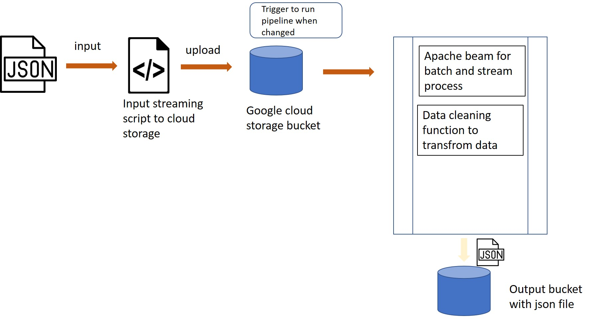

## Documentation of Solution approach To Cloud Data Engineer Challenge - Oyetola Taiwo


The architecture design for this pipeline namde _**pipeline-architecture.jpg**_ is present in the root folder of the sent zip file. It shows how the pipeline is able to process the inputs and give the desired output.

This solution is available on [THIS REPOSITORY](https://github.com/toyetola/trivago)



I have built this to run on Google Cloud 

> If we think of scaling and process a lot of jsonl files, we would need Google Cloud Apache Beam SDK to allow us perform batch and stream process. This allows for getting huge chunk of data processed and transformed easily


The requirement pointed out the need to automatic triggers of components. This why _Apache beam SDK_ would be great to use. I chose to use Apache beam with Google Cloud component _**Dataflow**_ which is essentially used to build 

I have to main files:

 * _**import.py**_
 * _**consolidation.py**_

 The [ _**import.py**_] (https://github.com/toyetola/trivago-test/blob/master/import.py) file is to help automate importing data to Google Cloud storage bucket. Basically help to collect file via its path from your local terminal 

 - You might want to install [virtualenv](https://realpython.com/python-virtual-environments-a-primer/) to run these files
 - You also need a google account and have acess to console.cloud.google.com
 - Create a bucket that holds the import jsonl files by going to menu and then select cloud storage I named mine _**acc-imports**_ as seen in the code. You may change this to your chosen name and the change should reflect in the file.
Activate our virtual environment and Change Directory to the root folder for this file  _**import.py**_
In our local terminal run `python import.py`
The file prompts for our import file url with is a json file that contains the data tobe transformed.
It gives you a message of successful upload to a directory signifying the year, day, month and hour of upload.

## The switch to Cloud Function (in GCP)
Because I could not successfully create a dataflow pipeline on GCP, I resorted to creating a cloud function that is triggered by a _change or an upload_ to the bucket earlier created for imports.

The Second file named _**consolidation.py**_ is the actuall processing pipeline file take takes in the file of interest, parses it and cleans it to the reuired format and writes to json file to be stored in another bucket

### Data Cleaning Functions

I have a list that contains sample partners name stored in variable _partnerList_ .  This can be replaced with your own list
```
partnerList = ["Partner_A", "Partner_B", "Partner_C", "Partner_D", "Partner_E",
               "Partner_F", "Partner_G", "Partner_H", "Partner_I", "Partner_J",
               "Partner_K", "Partner_L", "Partner_M", "Partner_N", "Partner_O"]
```
First is the function to consolidate : gets the file from a storage bucket and opens it up, rearrange based on priorities of the appearance of each Partner on the partners list and run the data cleaning block then output the reuired format. It like the near top level code.

Get details about this function here https://github.com/toyetola/trivago-test/blob/master/consolidation.py

```
consolidate(documentPath, partnerList)

```

Compare each object of the file and determine priority block

```
compareWithPartnerList(obj, partnerlist)

```
Clean data to get read of details not needed

```
getFinalisedData(arr)

```
This writes the cleaned data to a file and push to new output sbucket.
```
outputToFile(consolidatedData)
```

You could USE the GUI Cloud function to create the function in Google cloud console and paste https://github.com/toyetola/trivago-test/blob/master/consolidation.py in main.py

Deploy to run.

You can aslo run the __**local-consolidation.py**__ fileto have a feel of how the code works from your terminal

Activate your virtualenv, change directory to the location of  and run `python local-consolidation.py`

This takes in the path to the file you want to parse and give you the result.

the Requirements.txt looks like this
```
google-cloud
```

Or from the Cloud Shell run 

```
gcloud functions deploy hello_gcs \
--runtime python38 \
--trigger-resource YOUR_TRIGGER_BUCKET_NAME \
--trigger-event google.storage.object.finalize
```
